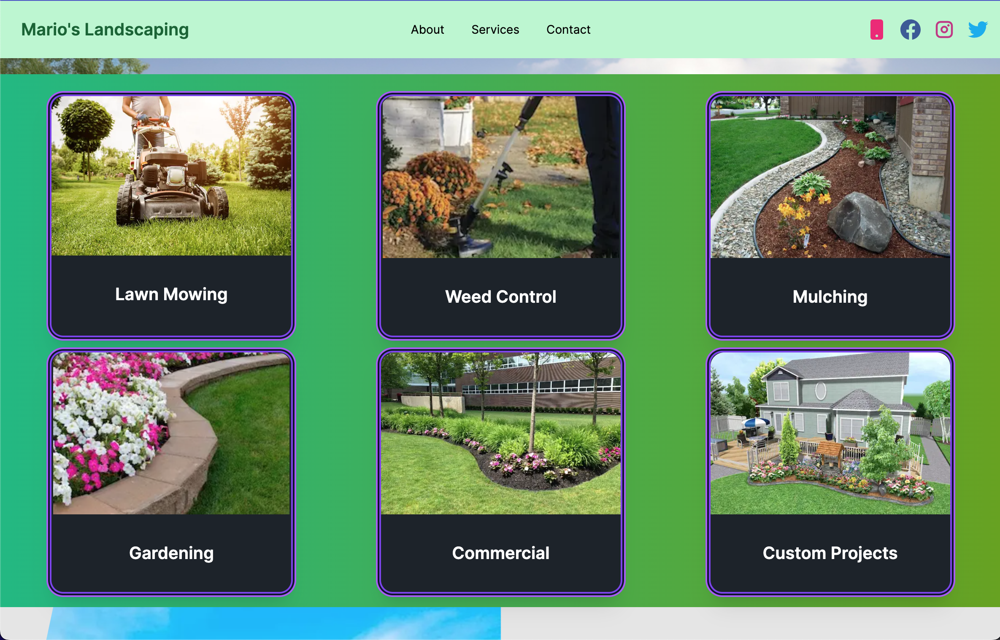
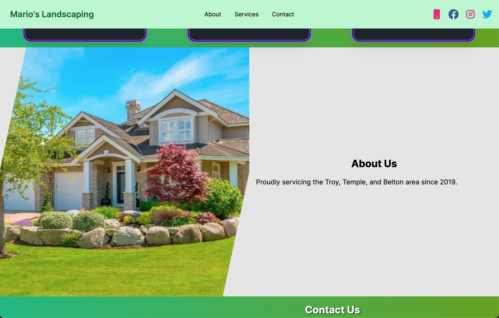
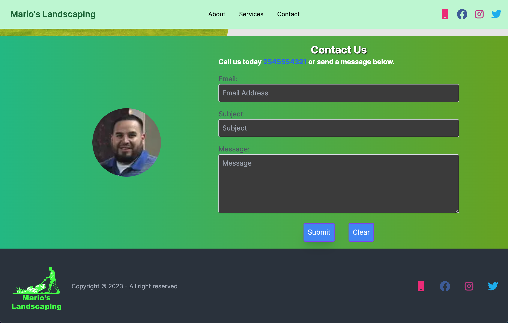
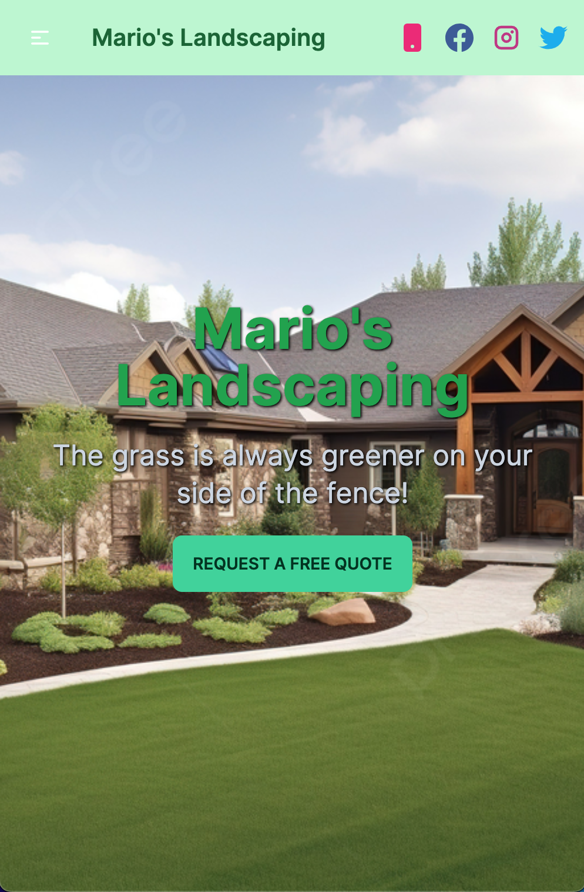

# Mario Landscaping - Freelance Client Website
<table bordercolor="#66b2b2">

<tr>
<td width="50%" valign="top">
    
</td>

<td width="50%" align="center" valign="top">
     
</td>
        </tr>
<tr>
<td width="50%" valign="top">
    
 </td>

<td width="50%" valign="top">
   
</td>
</tr>

<tr>
<td width="50%" valign="top">
     
</td>

<td width="50%" valign="top">
</td>
</tr>
    </table>

Welcome to the repository for the Mario Landscaping website, a project developed for a freelance client. This README provides an overview of the technologies and tools used in the project.

Take a look at it here 👉 https://mario-landscaping.netlify.app/

## Project Description

Mario Landscaping is a website designed to showcase the landscaping services provided by our client's business. It includes information about the company, services offered, contact details, and a contact form for potential customers to get in touch.

## Technologies Used

The project was built using the following technologies and tools:

- **Next.js**: A React framework for building web applications, providing server-side rendering and routing.

- **React**: A JavaScript library for building user interfaces.

- **Tailwind CSS**: A utility-first CSS framework for quickly styling web applications.

- **CSS Modules**: Used for local scoping of CSS styles in React components.

- **GitHub**: Version control and code collaboration platform for managing the project's source code.

- **Netlify**: Deployment platform for hosting the website.

- **Google Fonts**: Used for incorporating custom fonts in the project.

- **Next.js Image Component**: For optimizing and serving responsive images.

- **React Hook Form**: For handling form submission and validation.

## Project Structure

The project's code is organized into different directories and files:

- `pages/`: Contains Next.js pages for routing and rendering.

- `components/`: Reusable React components used throughout the application.

- `public/`: Static assets, including images and fonts.

- `styles/`: Custom CSS and Tailwind CSS configurations.

- `app/`: Application-wide configuration and global components.

- `utils/`: Utility functions and helper scripts.

- `README.md`: This documentation file.

- `.gitignore`: Lists files and directories to be excluded from version control.

- `package.json` and `package-lock.json`: Dependencies and project configuration.

- `next.config.js`: Next.js configuration.

- `tailwind.config.js`: Tailwind CSS configuration.

## Local Development

To run the project locally:

1. Clone the repository:

```bash
git clone https://github.com/djneill/Mario-Landscaping.git
